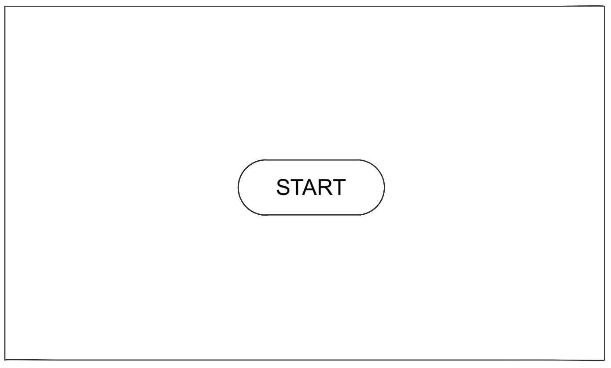
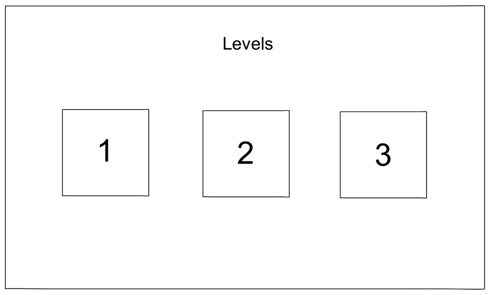
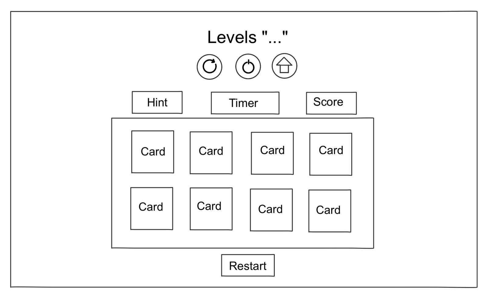

# Memory-Flash-Card


---

### By: Fatema Mohamed Albasri

---

### **_Description_**

Memory flash card game. The game displays a grid of face-down card, each card hiding an image. Player click on two cards at a time to flip them over, trying to find matching pairs.

---

### **_Technologies Used_**

- HTML
- CSS
- Javascript

---

### **_Getting Started_**

- Start game

  - Click on start button to beign

- Levels ( Click on the level to play it)

  - The game includes multiple levels ( 3 levels )
    - Only the first level will unlocked at the begining
    - Other levels will unlock after completing the previous level

- Display cards

  - When the level starts, all cards will be shown **face-up** for 5 seconds to help you memorize them.
  - After 5 seconds , the cards will be flip back to hide the images.

- Click on two cards to flip them and try to find a matching pair.

  - If cards match, they will remain face-up.
  - if they don't match, they will flip back after a short delay

- The level will end when all matching pairs are found and cards are face-up.

- There is a **restart button**: if want to restart the current level
- There is a **hint button**: show all cards for seconds and flip back
- There is **home button**: returns to the main menue (levels page)

- There is a **timer**: tracks how long you spend complete the level

- There is a **score**: score increasese based on
  - How quickly you complete the level (based on timer)
  - passing level

---

### **_Wireframe_**

#### Start page



#### Levels page (Home page)



#### Cards page



---

### **_Pseudo-Code_**

```
<--Start Page-->
  Wait until the player click on Start button
  Display levels page

<--Levels Page-->
  Set all levels to locked except level 1

  When player clicked on level
    if (the previous level is completed)
      Display card page for the selected level
    else
      the player can't play this level until passing the previous level

<--Card Page-->
  When game start:
    Show all cards face-up
    Wait 5 seconds
    Flip all cards face-down
    Start timer

  // number must change every level
  Set number of cards for the level = (e.g., 6, 8, 10, etc.)
  Set matched cards = 0
  // score updated every end level
  Set score = 0

  while (number of cards != 0 )
    Wait until the player clicked on first card
      if(the card already flip face-up)
        click again into another card
      else
        flip the first card face-up

    Wait until the player clicked on second card
      if(the card already flip face-up)
        click again into another card
      else
        flip the second card face-up

    if (first card and second card are not matched)
      flip first and second card face-down
      return
    else
      make first and second card face-up
      number of cards -=2
      matched cardes +=2

  // level complete
    if ( all cards are matched )
        Stop timer
        unlock next level

        if( spend time <= 10 seconds )
          score += 20
        else if ( spend time > 10 and spend time <= 20)
          score += 10
        else
          score += 5

        // adding the level number to the score and number of matched cards
        score = score + number of level + matched card

        Display level completed , spend time , score

        if(there is no next level)
          Display levels end , levels page
        else
          Display next level

  // buttons
    if (player clicked on restart button)
      Reset the game level

    if (player clicked on home button)
      return to the level page

    if (player clicked on hint button)
      flip all cards face-up for 3 seconds
      Flip the cards that already not matched face-down
```

---

### **_Credits_**

#### Colors : [color hunt](https://colorhunt.co/)
